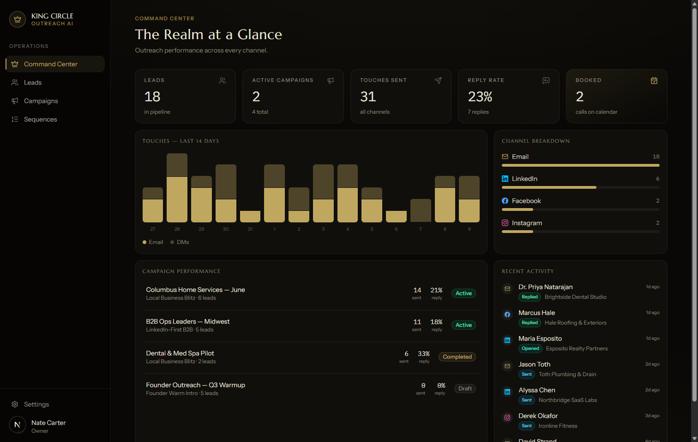
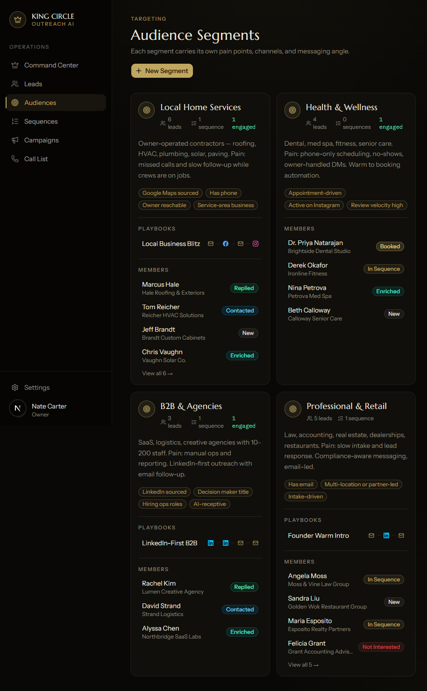
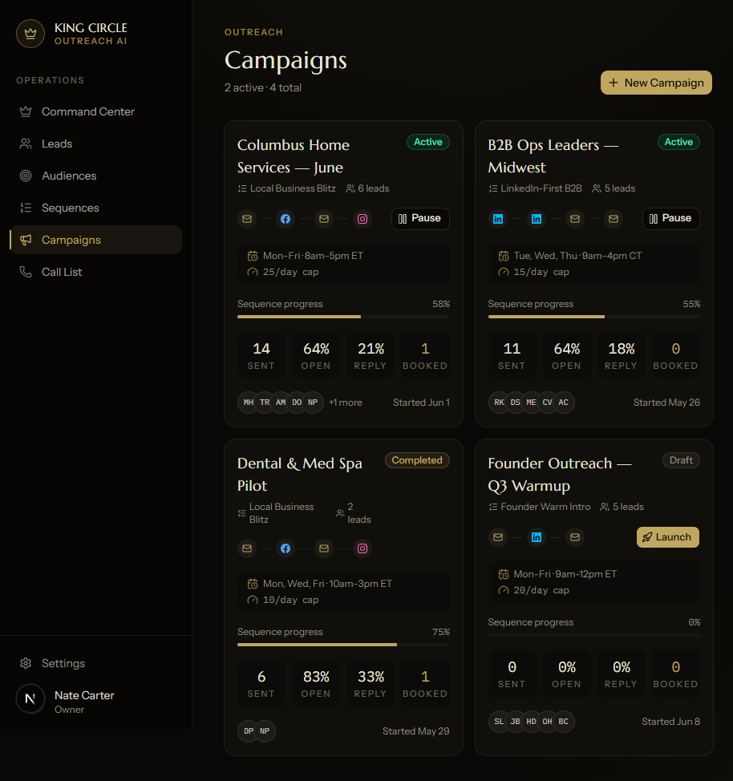
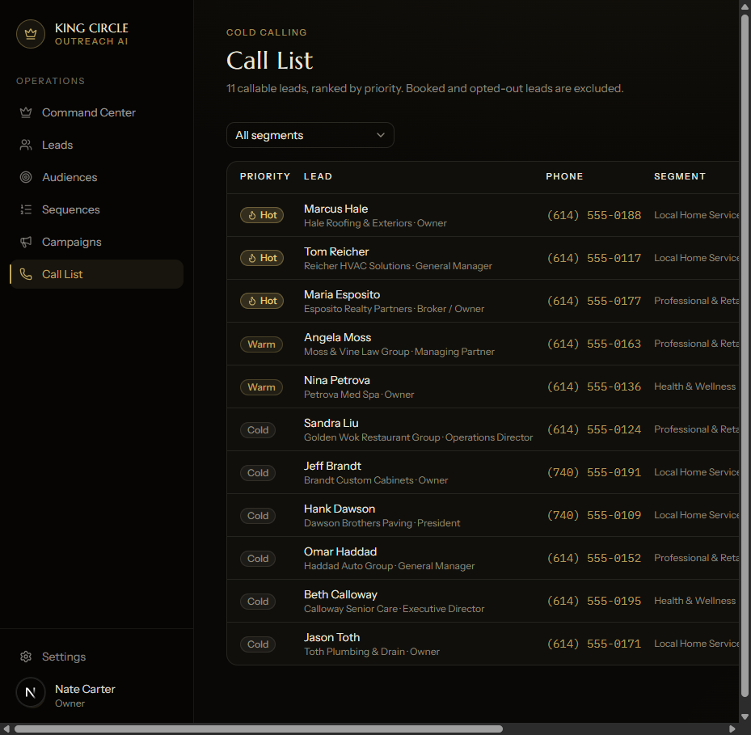
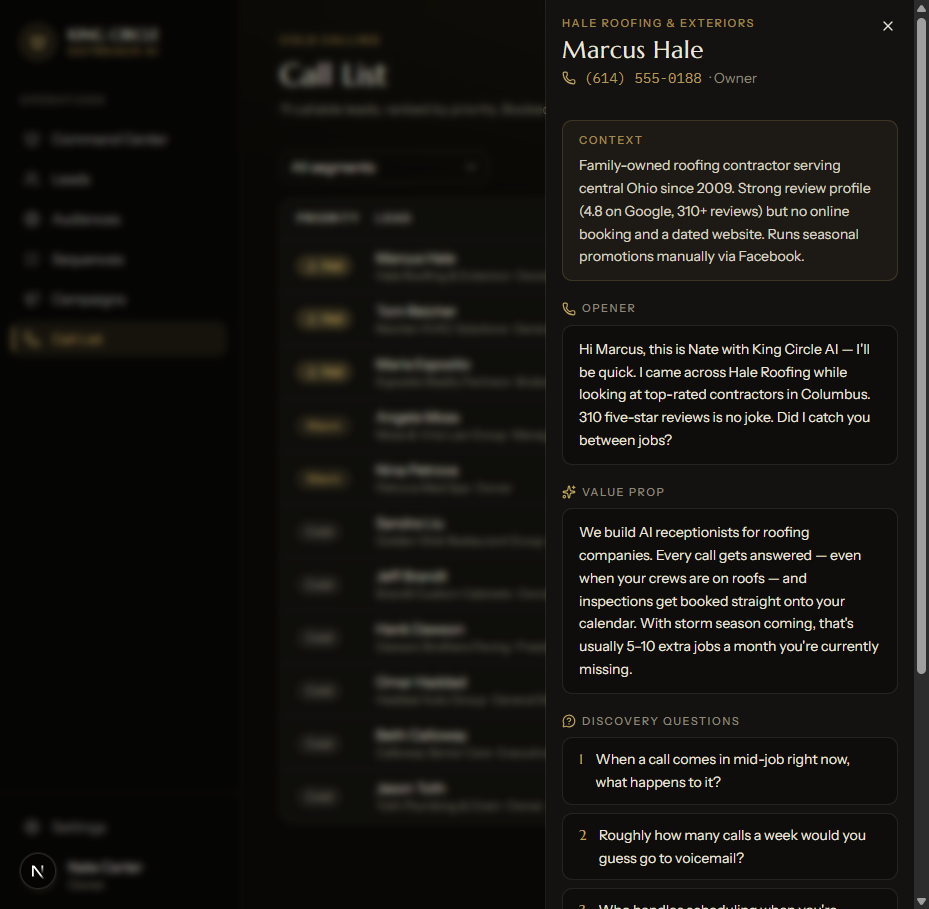
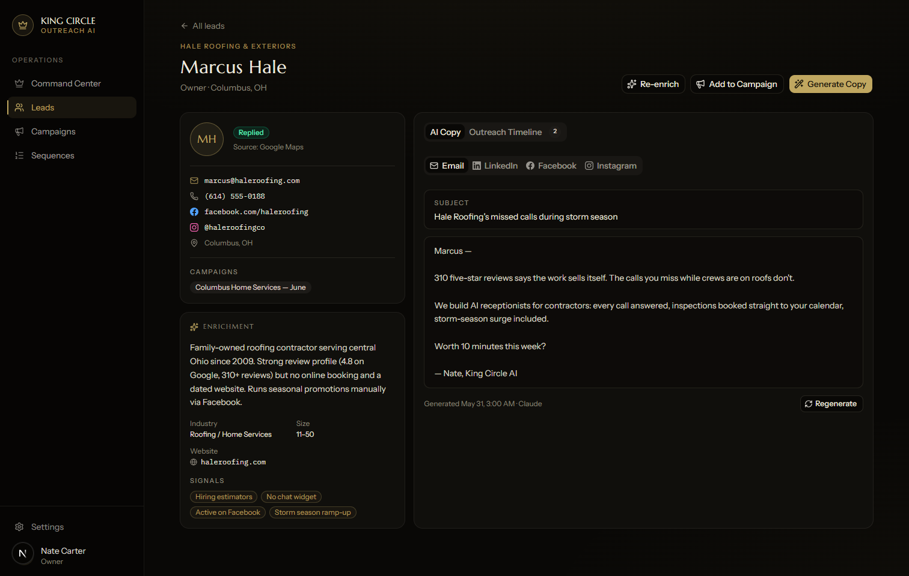
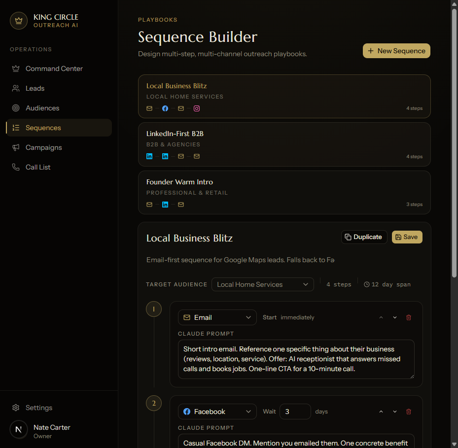

# King Circle AI — Outreach, Advertising & Lead Gen System

An internal command center for **King Circle AI** that scrapes leads, enriches them with AI research, generates personalized outreach copy with Claude, and runs multi-step sequences across email and DM channels — with cold-call support and full campaign analytics.

> **Status:** UI MVP complete (runs on a mock data layer). Backend wiring — Supabase, Apify, Exa, Claude, Instantly.ai, and the send engine — is the next phase.



---

## What It Does

| Capability | Screen | Status |
|---|---|---|
| Lead scraping (Google Maps + LinkedIn via Apify) | Leads → Scrape dialog | UI ✅ / wiring pending |
| Lead enrichment (Exa AI company context + buying signals) | Lead detail | UI ✅ / wiring pending |
| Audience segments with per-segment playbooks | Audiences | UI ✅ |
| AI copy generation per channel (email, LinkedIn, Facebook, Instagram) | Lead detail → AI Copy | UI ✅ / wiring pending |
| Multi-step sequence builder (channel + delay + Claude prompt per step) | Sequences | UI ✅ |
| Campaign builder with scheduling & send controls (windows, caps, pause/resume) | Campaigns | UI ✅ / send engine pending |
| Prioritized cold-call list with Claude call scripts + CSV export | Call List | UI ✅ (CSV export works) |
| Performance dashboard (sends, opens, replies, bookings by channel) | Command Center | UI ✅ / event tracking pending |

## Screens

| | |
|---|---|
|  |  |
|  |  |
|  |  |

---

## Architecture

```
Next.js Web Dashboard (Vercel)
├── Lead Generation     → Apify (Google Maps + LinkedIn actors)
├── Lead Enrichment     → Exa AI semantic search
├── AI Copy Generator   → Claude API (email, 3x DM channels, call scripts)
├── Sequence Builder    → Visual step editor (channel + delay + prompt)
├── Call List           → Prioritized dial list + Claude call scripts
└── Outreach Engine
    ├── Email           → Instantly.ai API
    ├── LinkedIn DM     → Playwright server automation
    ├── Facebook DM     → Playwright server automation
    └── Instagram DM    → Playwright server automation

Supabase (Postgres + Auth + Storage)
├── leads / lead_enrichments / segments
├── campaigns / campaign_leads
├── sequences / sequence_steps
├── outreach_logs / ai_copy_cache
└── integrations (encrypted API keys, session tokens)
```

The mock data layer (`kc-outreach/lib/data.ts`) mirrors this schema exactly, so swapping in real Supabase queries is a drop-in change.

## Tech Stack

- **Frontend:** Next.js 16 (App Router) · TypeScript · Tailwind CSS v4 · shadcn/ui
- **Backend (planned):** Supabase (Postgres, Auth, Storage)
- **AI:** Claude API via Anthropic SDK
- **Integrations (planned):** Apify, Exa AI, Instantly.ai, Playwright (server-side)
- **Hosting:** Vercel

## Getting Started

```bash
cd kc-outreach
npm install
npm run dev
```

Open [http://localhost:3000](http://localhost:3000). All screens run on seeded mock data — no environment variables or API keys required yet.

```bash
npm run build   # production build
npm run lint    # eslint
```

## Roadmap

- [x] **Phase 0 — UI MVP**: all screens (Command Center, Leads, Audiences, Sequences, Campaigns, Call List) on mock data
- [ ] **Phase 1 — Foundation**: Supabase schema migration + auth, swap mock layer for real queries
- [ ] **Phase 2 — Lead Generation**: Apify actor wiring (Google Maps `compass/crawler-google-places`, LinkedIn `harvestapi/linkedin-profile-search`), dedupe + import
- [ ] **Phase 3 — Enrichment**: Exa AI per-lead research; evaluate Apollo/Hunter for email coverage
- [ ] **Phase 4 — Copy Generation**: Claude API for per-channel copy + call scripts, cached per lead
- [ ] **Phase 5 — Send Engine**: Instantly.ai email integration, Playwright DM runner, cron scheduler with stop-on-reply and human-like pacing
- [ ] **Phase 6 — Live Analytics**: open/reply webhooks feeding the dashboard, conversion tracking

## Key Technical Constraints

- **Exa AI does not return emails** — contact data comes from Apify extraction or a secondary enricher (Apollo/Hunter, decision pending)
- **Playwright must run server-side** (Node.js) — never in the browser or Supabase Edge Functions
- **Apify runs are async** (minutes to hours) — trigger, then poll or receive a webhook
- **Official Meta/LinkedIn APIs do not support cold DMs** — DM automation uses Playwright with stored session cookies (ToS risk acknowledged; internal use only)
- **Scheduler:** Vercel Cron free tier is 1 run/day; hour-level follow-up timing will need Supabase pg_cron or Inngest

## Scope

Internal tool for King Circle AI — single-tenant, no SaaS features. Deferred: cold-calling app (Lovable) integration, KC Dashboard pipeline connection, mobile app.

See [plan.md](plan.md) for the full build plan, database schema, and verification steps.

---

**King Circle AI** · Owner: Nate Carter
